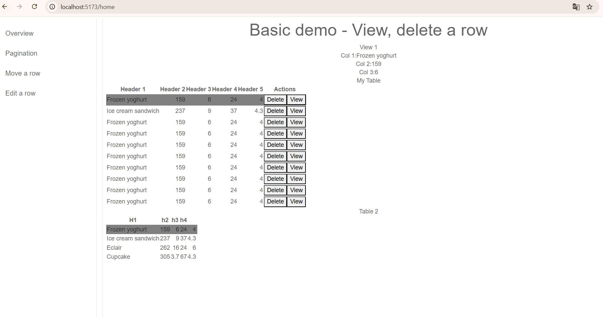
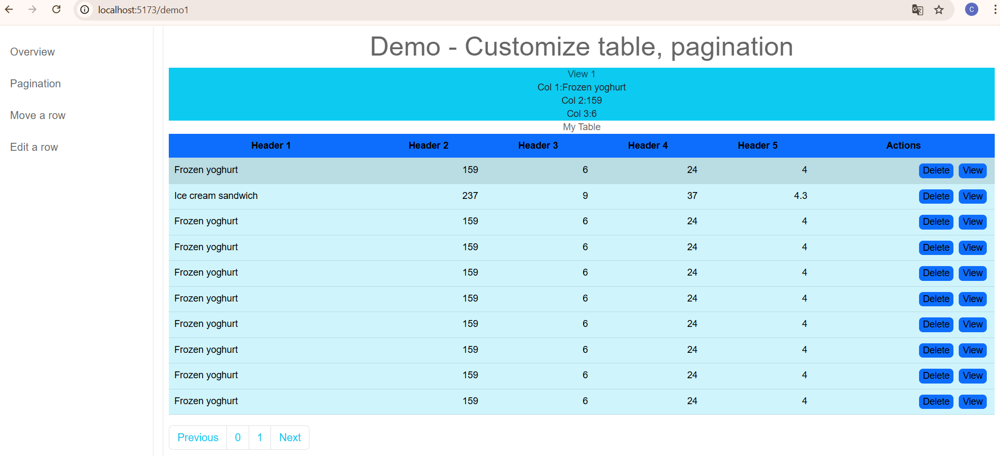
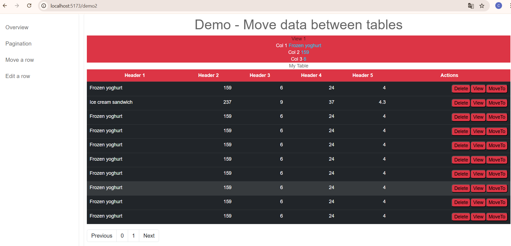
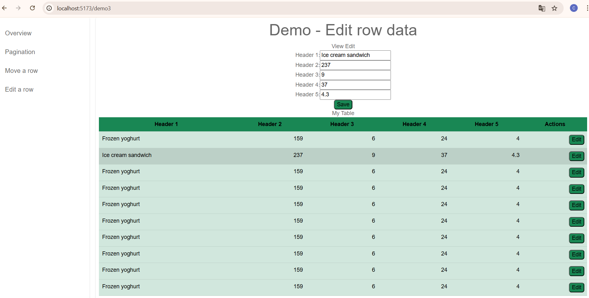

# ReactSync Table App

A modern web application built with **React** and **ReactSync** for efficient, real-time table data management. This project demonstrates how to create dynamic, responsive, and synchronized tables that update seamlessly across clients.

---

## 🚀 Features

- ⚡ Real-time data synchronization with ReactSync
- 📊 Dynamic table rendering
- ✏️ Inline editing of table rows and cells
- 🔍 Sorting, filtering, and searching
- 📱 Responsive design
- 🔄 State management with minimal boilerplate
- 🧩 Modular and scalable component structure

---

## 🛠️ Tech Stack

- **React** – UI library
- **ReactSync** – Real-time synchronization
- **JavaScript / TypeScript** – Core language
- \*\*CSS / Bootstrap

---

## 📦 Installation

Clone the repository:

```bash
git clone https://github.com/bangcaodinh2020-droid/Demo-TableComponent-With-ReactSync.git
cd Demo-TableComponent-With-ReactSync
```

Install dependencies:

```bash
npm install
```

or

```bash
yarn install
```

---

## ▶️ Running the App

Start the development server:

```bash
npm run dev
```

```
http://localhost:5173
```

Start the product server:

```bash
yarn run build
```

Then

```bash
yarn run preview
```

Then open your browser at:

```
http://localhost:4173
```

---

## 📁 Project Structure

```
src/
│
├── components/        # Reusable UI components
│   ├── Table/
│   ├── TableRow/
│   └── TableCell/
│
├── pages/             # Custom paging
│
├── layouts/          # Custom layout
│
├── App.js             # App
│
├── Main.js             # Main
└── index.html          # Entry point
```

---

## 🔧 Configuration

Update your ReactSync configuration in:

Example:

```javascript
import BaseComponent, {ButtonComponent,
  MessageType,
  TestComponent,
  TableComponent,
  CounterComponent,
  ViewRowComponent,
  PaginationComponent
} from "@bangcao2020/reactsync";


---

## 📊 Usage

### Example 1- View, delete a row.
```

<App id="appLayout" data={{ syncData:{
mode:"production",
tableData:{rows:AddRow(10), columns: columns},
table2:{rows: rows2, columns: columns2},

                      }}}/>

### Then you can use like this.

<ViewRowComponent id="viewRow1"
data={{fromTableName:"tableData",
          fields:["Col 1", "Col 2", "Col 3"],
          styles:{}
          }}>View 1</ViewRowComponent>

          <TableComponent id="testTable"
          data={{tableName:"tableData",
          tableTarget:"table2",
          actions:[{label:"Delete", type:"deleteARow"}, {label:"View", type:"viewARow"},],
          syncers:["viewRow1", "viewRow2", "testTable2"],

          }}> My Table</TableComponent>

```

### Example 2 - Customize table, pagination

```

<TableComponent id="testTable11"
data={{tableName:"tableData",
                  tableTarget:"table2",
                  syncers:["viewRow11", "viewRow12", "testTable12"],
                  actions:[{label:"Delete", type:"deleteARow"}, {label:"View", type:"viewARow"}],
                  styles:{table:"table table-info table-hover", tbody:"", tr:"", th:"bg-primary", td:"", button:"rounded bg-primary border border-0 mx-1"  },
                  }}> My Table</TableComponent>

                   <PaginationComponent id={"pagination11"}
                   data={{rowsPerPage:10,
                    numOfPageNode:4,
                    tableName:"tableData",
                    syncers:["testTable11"],
                    styles:{button:"page-link text-info"}}}></PaginationComponent>

```

### Example 3 - Move data between tables
```

<TableComponent id="testTable11"
data={{tableName:"tableData",
                  tableTarget:"table2",
                  syncers:["viewRow11", "viewRow12", "testTable12"],
                  actions:[{label:"Delete", type:"deleteARow"}, {label:"View", type:"viewARow"}],
                  styles:{table:"table table-info table-hover", tbody:"", tr:"", th:"bg-primary", td:"", button:"rounded bg-primary border border-0 mx-1"  },
                  }}> My Table</TableComponent>

                   <PaginationComponent id={"pagination11"}
                   data={{rowsPerPage:10,
                    numOfPageNode:4,
                    tableName:"tableData",
                    syncers:["testTable11"],
                    styles:{button:"page-link text-info"}}}></PaginationComponent>

```

### Example 4 - Edit row data
```

<EditRowComponent id="viewRow32"
data={{
styles:{button:"bg-success rounded"},

             }}>View Edit</EditRowComponent>


          <TableComponent id="testTable31"
          data={{tableName:"tableData",
          tableTarget:"table2",
          syncers:["viewRow31", "viewRow32", "testTable32"],
          actions:actions,
          styles:styles,
          }}> My Table</TableComponent>

---

## 🤝 Contributing

Contributions are welcome!

1. Fork the repository
2. Create your feature branch
3. Commit your changes
4. Push to the branch
5. Open a Pull Request

---

## 📄 License

This project is licensed under the MIT License.

---

## 💡 Future Improvements

- Pagination for large datasets
- Role-based access control
- Export to CSV / Excel
- Drag-and-drop row reordering

---

## 👤 Author

Your Name
GitHub: https://github.com/bangcaodinh2020-droid
Linkedin: linkedin.com/in/bangcao24

---

## ⭐ Acknowledgements

- React community
- ReactSync contributors

---

```

```




